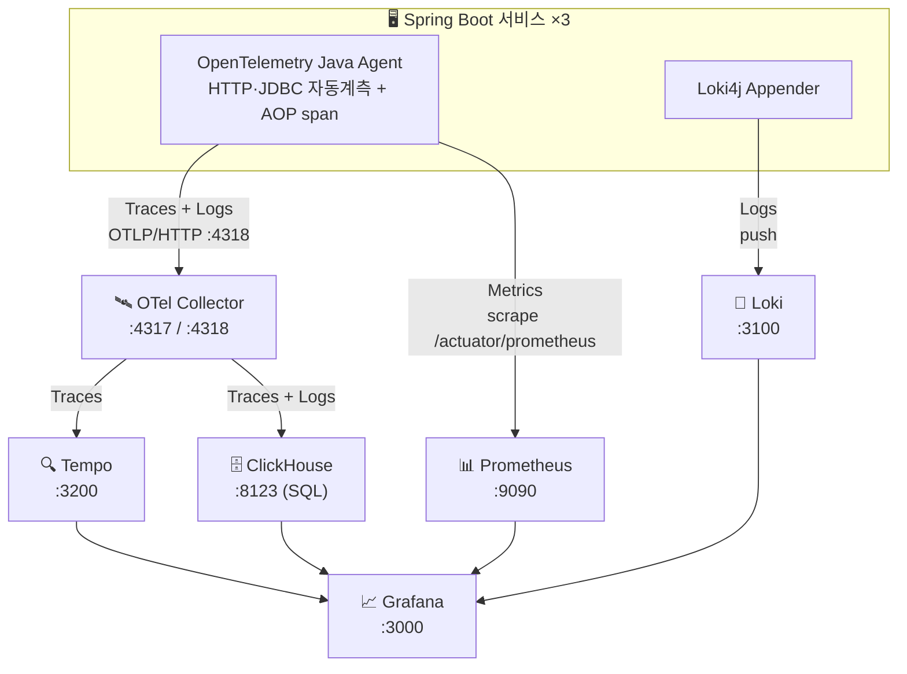

# Spring Boot LGTM Observability

**OpenTelemetry Java Agent + AOP 기반 자동 추적을 제공하는 Spring Boot 관측가능성 스타터 프로젝트**

LGTM 스택(**L**oki, **G**rafana, **T**empo, Prometheus **M**etrics)을 활용한 완전한 관측가능성을 제공합니다.

> **이 브랜치**는 OTel Collector를 추가해 트레이스·로그를 **LGTM과 ClickHouse 양쪽으로 동시 전송(fan-out)**하고,
> Grafana에서 두 백엔드(Tempo/Loki vs ClickHouse SQL)를 나란히 비교할 수 있도록 확장했습니다.
> 애플리케이션 코드 변경 없이 agent의 OTLP 엔드포인트만 Collector로 바꾼 구성입니다.

## 주요 특징

- 🔍 **Zero-Code Tracing** - OpenTelemetry Java Agent로 HTTP, JDBC, 메시지 큐 자동 계측
- 🎯 **AOP 메서드 추적** - `@Service`, `@Repository` public 메서드 자동 span 생성
- 🔗 **로그-트레이스 연동** - 로그 → 트레이스, 트레이스 → 로그 양방향 링크
- 📊 **자동 대시보드** - JVM 및 애플리케이션 메트릭 대시보드 프로비저닝
- 📦 **재사용 모듈** - `observability-core` 의존성 하나로 모든 기능 활성화

## 빠른 시작

```bash
# 저장소 클론
git clone https://github.com/wisehero/spring-boot-LGTM.git
cd spring-boot-LGTM

# 빌드
./gradlew build

# 전체 스택 실행 (LGTM + 마이크로서비스 3종 + PostgreSQL)
cd docker && docker-compose up -d

# 상태 확인
docker-compose ps
```

**서비스 접속:**

| 서비스 | URL | 인증 |
|--------|-----|------|
| order-service | http://localhost:8080 | - |
| product-service | http://localhost:8081 | - |
| payment-service | http://localhost:8082 | - |
| Grafana | http://localhost:3000 | admin / admin |
| Prometheus | http://localhost:9090 | - |
| Tempo | http://localhost:3200 | - |
| Loki | http://localhost:3100 | - |
| ClickHouse | http://localhost:8123 | default / (비밀번호 없음) |
| OTel Collector (health) | http://localhost:13133 | - |

## 아키텍처



> 트레이스는 **Tempo와 ClickHouse 양쪽**으로, 로그는 **Loki(Loki4j 직결)와 ClickHouse(Collector 경유)** 양쪽으로 흐릅니다.
> Grafana에서 동일 데이터를 두 백엔드로 비교할 수 있습니다.

## 트레이스 예시

`POST /api/orders` 호출 시 Tempo에서 확인되는 분산 트레이스 (3개 서비스에 걸침):

```
POST /api/orders                              520ms  [order-service]
└─ OrderService.createOrder                   515ms
   ├─ GET /api/products/{id}        [HTTP]      12ms  → product-service
   │  └─ ProductService.getProduct              8ms
   │     └─ SELECT * FROM products WHERE id=?   3ms
   ├─ GET /api/products/{id}/stock   [HTTP]     10ms  → product-service
   ├─ INSERT INTO orders                         5ms
   ├─ POST /api/payments             [HTTP]    300ms  → payment-service
   │  └─ PaymentService.processPayment         295ms  (결제 지연 시뮬레이션 100~500ms)
   │     └─ INSERT INTO payments                 4ms
   ├─ PATCH /api/products/{id}/stock [HTTP]     15ms  → product-service
   │  └─ ProductService.decreaseStock           10ms
   │     └─ UPDATE products SET stock=?,version=? 5ms
   └─ UPDATE orders SET status=?                 5ms
```

> 메서드 레벨 span(`OrderService.createOrder` 등)은 `observability-core`의 `TracingAspect`가 생성하며,
> `observability.tracing.aop.enabled=true`(각 서비스 `application.yml`에 설정됨)일 때 활성화된다.
> HTTP/JDBC span은 OpenTelemetry Java Agent가 자동 계측한다.

## 프로젝트 구조

```
spring-boot-LGTM/
├── observability-core/          # 재사용 가능한 관측가능성 모듈 (스타터)
│   └── src/.../observability/
│       ├── aspect/              # TracingAspect, ObservabilityAspect
│       ├── config/              # ObservabilityAutoConfiguration, Metrics/Tracing/Logging
│       └── filter/              # RequestLoggingFilter
├── order-service/               # 주문 (오케스트레이터: product·payment 호출 + 결제 보상)
├── product-service/             # 상품·재고 (낙관적 락)
├── payment-service/             # 결제 (시뮬레이션 + 보상 취소 API)
├── docker/                      # LGTM + ClickHouse 인프라 + 서비스 컨테이너
│   ├── docker-compose.yml       # 서비스 Dockerfile은 OTel Java Agent 포함
│   ├── otel-collector/          # Collector 설정 (Tempo + ClickHouse fan-out)
│   ├── prometheus/
│   ├── loki/
│   ├── tempo/
│   └── grafana/
└── docs/                        # 문서
    ├── SETUP_GUIDE.md           # 설정 가이드 (10단계)
    ├── ARCHITECTURE.md          # 아키텍처 상세
    └── USAGE.md                 # 사용 가이드
```

## 기술 스택

| 컴포넌트 | 버전 | 용도 |
|---------|------|------|
| Spring Boot | 3.4.1 | 애플리케이션 프레임워크 |
| Kotlin | 1.9.22 | 프로그래밍 언어 |
| OpenTelemetry Agent | 2.11.0 | 자동 계측 |
| Micrometer | 1.14.2 | 메트릭 추상화 |
| Grafana | 11.4.0 | 시각화 |
| Prometheus | 2.55.1 | 메트릭 저장소 |
| Loki | 3.3.2 | 로그 집계 |
| Tempo | 2.6.1 | 분산 추적 |
| OTel Collector (contrib) | 0.116.0 | OTLP 수신 → Tempo·ClickHouse fan-out |
| ClickHouse | 24.8 | 트레이스·로그 통합 OLAP 저장소 (SQL) |

## 문서

| 문서 | 설명 |
|------|------|
| **[설정 가이드](docs/SETUP_GUIDE.md)** | 자신의 프로젝트에 적용하는 10단계 가이드 |
| [아키텍처](docs/ARCHITECTURE.md) | 시스템 구조 및 데이터 흐름 |
| [사용 가이드](docs/USAGE.md) | 상세 사용법 및 커스터마이징 |
| [ClickHouse 전환](docs/CLICKHOUSE.md) | ClickHouse 병렬 도입 배경·기대효과·트레이드오프 |

## 외부 참고 자료

- [OpenTelemetry Java Agent](https://opentelemetry.io/docs/zero-code/java/agent/)
- [Grafana LGTM Stack](https://grafana.com/docs/lgtm/)
- [Spring Boot Observability](https://docs.spring.io/spring-boot/reference/actuator/observability.html)

## 라이선스

MIT

---

마지막 업데이트: 2026-06-13
